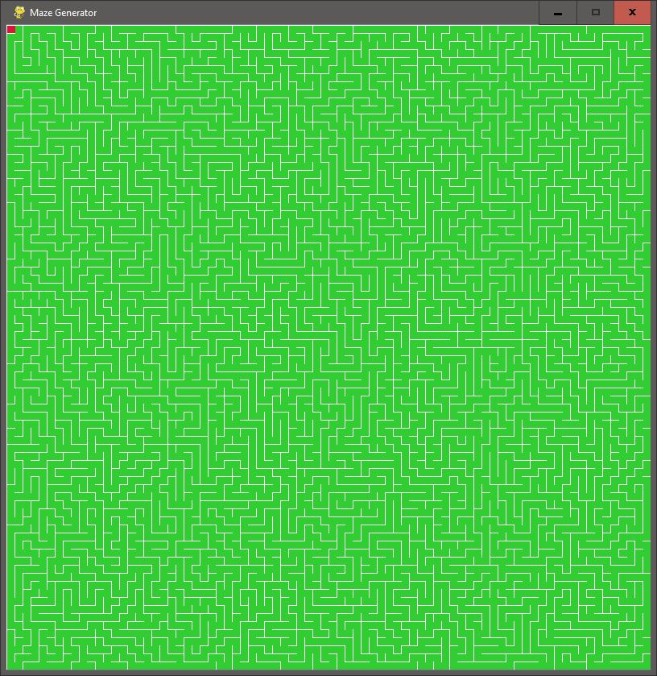

# Maze Generator

This project generates a maze using the **recursive backtracking algorithm** and displays it in real-time using the **Pygame** library. The maze is created by visiting each cell, removing walls, and backtracking when necessary.

## Features:
- **Maze Generation**: Generates a random maze using a recursive backtracking algorithm.
- **Real-Time Visualization**: Displays the maze generation process in real time.
- **Customizable Grid**: The grid size can be adjusted by changing the `w` (width of each cell) and the window size parameters.

## How It Works:
1. **Grid Creation**: The grid is created with cells, each having four walls (top, right, bottom, left).
2. **Recursive Backtracking**: The maze is generated by recursively visiting cells, removing walls between neighboring cells, and backtracking when no unvisited neighbors are found.
3. **Maze Visualization**: The maze is drawn to the screen using Pygame, with visited cells and current cells highlighted for better understanding of the algorithm's progression.

    
    
Here is a completed Maze generation cycle

## Code Overview

### Main Program (`main.py`)
This program utilizes **Pygame** to visually display the maze generation process, which is based on the recursive backtracking algorithm.

1. **Imports**:  
   - `pygame` for visualization and event handling.
   - `math` and `random` for mathematical calculations and randomization of maze generation.

2. **Grid and Cell Setup**:  
   - The maze is divided into a grid, where each cell is represented by the `Cell` class. 
   - Each cell has four walls and a visited status to determine whether it has been part of the maze generation process.

3. **Recursive Backtracking Algorithm**:  
   - The algorithm starts at the first cell, marks it as visited, and checks its neighbors.
   - If a neighboring cell has not been visited, the algorithm removes the wall between the current cell and the neighbor, then moves to that neighbor and repeats the process.
   - If all neighbors are visited, it backtracks to the previous cell and continues.

4. **Visualization**:  
   - Each cell is drawn with walls and color-coded based on whether it has been visited or is currently being processed.
   - The grid and maze are updated in real time using the Pygame event loop.

### Key Variables:
- **`win_width`, `win_height`**: The width and height of the window displaying the maze.
- **`w`**: The width of each individual cell in the grid.
- **`cols`, `rows`**: The number of columns and rows in the grid based on the window size and cell width.
- **`grid`**: A list of all the cells in the grid.
- **`current`, `next`**: The current and next cell in the maze generation process.
- **`stack`**: A stack used for backtracking when no unvisited neighbors are found.
